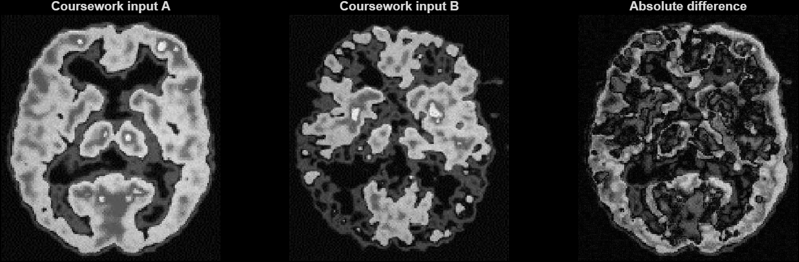
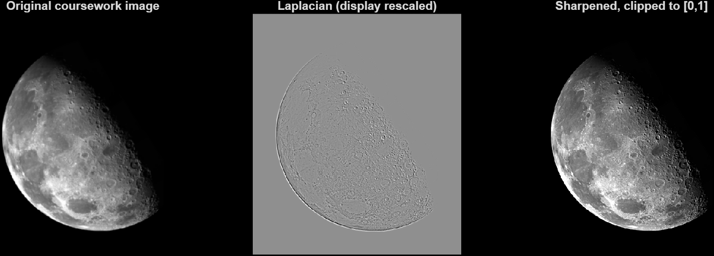

[**فارسی**](README.md) | [English](README.en.md)

# MATLAB Image Processing


I worked on two image-processing exercises for university: comparing brain images and sharpening a Moon image with a Laplacian filter.

I have included the MATLAB functions, the images used in the exercises, and the result figures. You can run the demo to generate the results again. All files are in the repository root.

## 1. Absolute image difference

The first two panels show the supplied brain images. The third shows their absolute pixel-intensity difference.



[Open the brain comparison image](brain-difference-result.png)

The original filenames imply diagnostic labels, but those labels have not been independently verified. This exercise compares image intensities; it does not diagnose disease. Resizing an image is not anatomical registration.

## 2. Laplacian sharpening

The panels show the supplied Moon image, its signed Laplacian response rescaled for display, and the sharpened result.



[Open the Moon sharpening image](moon-sharpening-result.png)

The kernel is `[0 1 0; 1 -4 1; 0 1 0]`. The function uses replicated boundaries, subtracts the response from the grayscale input, and clips the output to [0,1]. Sharpening can amplify noise; display scaling does not change the computed response.

## Run the project

Requires **MATLAB and Image Processing Toolbox**. Tested with MATLAB R2025b.

Download this repository, open its folder in MATLAB, and run:

```matlab
verify_examples
run_demo
```

The demo regenerates `brain-difference-result.png` and `moon-sharpening-result.png` in the same folder. It uses the bundled images; no extra data download is required.

To process your own images:

```matlab
[difference, first, second] = image_difference('first.png', 'second.png');
[sharpened, response, gray] = laplacian_sharpen('my-image.png');
```

`to_grayscale` accepts an image filename or array. RGB images become grayscale, integer inputs are normalized with `im2double`, and floating-point inputs must already be finite and in [0,1]. When sizes differ, `image_difference` resizes the second grayscale image using bilinear interpolation.

## Files

| File | Purpose |
|---|---|
| `image_difference.m` | Absolute difference between two images |
| `laplacian_sharpen.m` | Laplacian response and sharpening |
| `to_grayscale.m` | Shared image loading, conversion and validation |
| `run_demo.m` | Regenerate both result figures |
| `verify_examples.m` | Controlled correctness checks |
| `normalBrainGray.jpg`, `alzaimerBrainGray.jpg` | Original coursework comparison inputs |
| `Laplacian.tif` | Original coursework Moon image |
| `brain-difference-result.png`, `moon-sharpening-result.png` | Generated result figures |

The checks cover constant images, impulse response, identical images, mismatched dimensions, RGB conversion, and invalid inputs. See [verification](VERIFICATION.md).

## Background and image sources

My original scripts were named `substraction.m` and `laplacian.m`. The version here separates the processing into reusable functions and includes a demo, checks, and English and Persian documentation.

The input images were supplied with the coursework. Their upstream source and license are unrecorded; no new image license or dataset ownership is asserted. See [input provenance](INPUTS.md).
